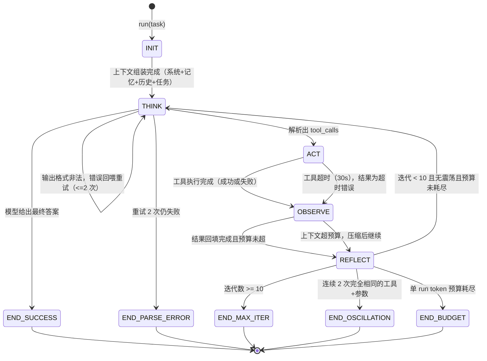
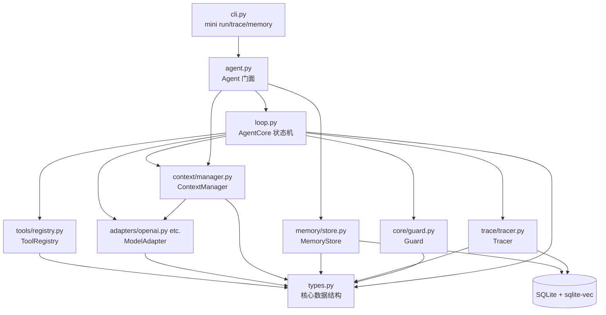

# MiniAgent · 阶段 0 总体设计

> 项目：自研 Mini Agent 框架（无重型框架依赖）
> 本文档性质：设计文档，不含实现代码。阶段 0 的产出 = 本文档。
> 下一动作：验收清单全部勾选并确认后，进入阶段 1（最小循环）。

---

## 1. AgentCore 状态机设计

### 1.1 状态机图



### 1.2 状态职责表

| 状态 | 职责 | 谁执行 |
|---|---|---|
| INIT | 组装初始上下文：系统提示 → top-k 记忆 → 压缩历史 → 当前任务；创建 run_id、初始化 Guard 计数器 | AgentCore |
| THINK | 调 ModelAdapter 拿模型输出；解析为"最终答案"或"工具调用"；解析失败进入自愈重试 | AgentCore + ModelAdapter |
| ACT | 通过 ToolRegistry 执行工具；30s 超时；幻觉调用返回结构化错误 | AgentCore + ToolRegistry |
| OBSERVE | 把 ToolResult 格式化回填为消息；触发 ContextManager 预算检查与压缩 | AgentCore + ContextManager |
| REFLECT | 终止判定：最大迭代 / 震荡 / 预算耗尽；未触发则进入下一轮 | AgentCore + Guard |
| END | 汇总 AgentRun（状态、答案、trace、token、耗时）；Tracer 落库收尾 | AgentCore + Tracer |

### 1.3 终止路径清单（共 5 条，必须全部可观测）

| 终止路径 | 触发条件 | 对外表现 |
|---|---|---|
| END_SUCCESS | 模型给出最终答案 | answer 非空 |
| END_MAX_ITER | 迭代 >= 10 | status=MAX_ITER，附已完成步骤摘要 |
| END_OSCILLATION | 连续 2 次相同工具 + 相同参数 | status=OSCILLATION，附重复的调用内容 |
| END_BUDGET | 单 run token >= 100k（可配） | status=BUDGET_EXCEEDED，附 token 消耗明细 |
| END_PARSE_ERROR | 格式错误重试 2 次仍失败 | status=PARSE_ERROR，完整 trace 已保存 |

设计要点：每条异常终止都必须"死得明白"——status + termination_reason + 完整 trace，禁止静默结束。这是阶段 6 失败注入测试的直接依据。

---

## 2. 模块依赖图

### 2.1 依赖图



### 2.2 依赖规则（代码 review 时按此检查）

1. **types.py 是唯一的公共语言**：所有模块互相通信只通过 Message / ToolCall / ToolResult / TraceStep / AgentRun，禁止跨模块访问对方的内部状态。
2. **AgentCore 是唯一编排者**：只有 loop.py 知道状态机；ToolRegistry / ModelAdapter 不知道彼此存在。
3. **无循环依赖**：ContextManager 压缩需要 LLM 调用，但通过构造函数注入 ModelAdapter 接口，而不是 import AgentCore。
4. **Guard 是纯函数**：只做计数与阈值判断（输入计数器，输出 True/False + 原因），零外部依赖，最容易测试。
5. **Tracer / MemoryStore 只碰 SQLite**：不依赖任何模型或工具模块，可独立替换。
6. **ToolRegistry 对 agent 无感知**：工具系统可以脱离 agent 单独测试和复用。

---

## 3. 核心数据结构（Pydantic 草稿）

```python
from __future__ import annotations
from datetime import datetime
from enum import Enum
from typing import Any, Literal
from pydantic import BaseModel, Field

Role = Literal["system", "user", "assistant", "tool"]


class ToolCall(BaseModel):
    """模型发起的一次工具调用请求（未执行）。"""
    id: str = Field(description="调用唯一 ID，用于把 tool 角色消息关联回 assistant 消息")
    name: str = Field(description="工具名；若为幻觉调用，registry 会返回结构化错误")
    arguments: dict[str, Any] = Field(default_factory=dict, description="实参，执行前才按 schema 校验")


class Message(BaseModel):
    """框架内部唯一的消息表示（模型无关）。"""
    role: Role
    content: str | None = Field(default=None, description="文本内容；tool 消息为结果 JSON 序列化")
    tool_calls: list[ToolCall] | None = Field(default=None, description="仅 assistant 消息：本轮请求的工具调用")
    tool_call_id: str | None = Field(default=None, description="仅 tool 消息：对应的 ToolCall.id")
    name: str | None = Field(default=None, description="仅 tool 消息：工具名")
    token_count: int | None = Field(default=None, description="预算估算用；入库时填充")
    created_at: datetime = Field(default_factory=datetime.now)


class ToolSpec(BaseModel):
    """@tool 装饰器自动生成的工具规格。"""
    name: str
    description: str = Field(description="来自 docstring 首段")
    parameters: dict[str, Any] = Field(description="由 Pydantic 参数模型导出的 JSON Schema")


class ToolResult(BaseModel):
    """一次工具执行的统一结果（含失败）。"""
    call: ToolCall
    ok: bool
    data: Any | None = Field(default=None, description="成功时的结构化返回")
    error: str | None = Field(default=None, description="失败时的可读错误信息，必须回喂模型")
    duration_ms: int = Field(description="执行耗时，Guard 与 trace 使用")


class RunStatus(str, Enum):
    SUCCESS = "success"
    MAX_ITER = "max_iterations"
    OSCILLATION = "oscillation"
    BUDGET_EXCEEDED = "budget_exceeded"
    PARSE_ERROR = "parse_error"


class Usage(BaseModel):
    prompt_tokens: int = 0
    completion_tokens: int = 0
    estimated_cost_usd: float = 0.0


class TraceStep(BaseModel):
    """Tracer 落库的最小单位：一步一个记录。"""
    run_id: str
    step: int
    state: Literal["INIT", "THINK", "ACT", "OBSERVE", "REFLECT", "END"]
    tool_name: str | None = None
    tool_args: dict[str, Any] | None = None
    result_ok: bool | None = None
    usage: Usage = Field(default_factory=Usage)
    duration_ms: int = 0
    extra: dict[str, Any] = Field(default_factory=dict, description="终止原因/压缩统计/重试次数等")


class AgentRun(BaseModel):
    """run() 的返回值：一次任务的完整结果与执行轨迹。"""
    run_id: str
    task: str
    status: RunStatus
    answer: str | None = Field(default=None, description="SUCCESS 时为最终答案，异常终止时为善后说明")
    iterations: int = Field(description=actual := "THINK→ACT→OBSERVE 完整轮数")
    steps: list[TraceStep] = Field(default_factory=list)
    usage: Usage = Field(default_factory=Usage)
    termination_reason: str | None = None
    started_at: datetime
    finished_at: datetime | None = None
```

> 注：草稿中 `iterations` 的 Field(description=...) 写法在实现时改为普通字符串，此处示意即可。

字段设计原则：
- **每多余一个字段都要能回答"谁读它"**——例如 tool_call_id 只有 adapter 转换 Anthropic 格式时需要；
- ToolResult 不放进 Message：工具执行结果先以 ToolResult 存在（含耗时、ok 状态），回填时才转成 tool 角色的 Message；
- TraceStep.extra 是唯一的逃生舱字段，防止 schema 频繁变动导致迁移麻烦。

---

## 4. 公共 API 草稿

### 4.1 Python API

```python
from mini_agent import Agent, tool

@tool
def calculator(expression: str) -> str:
    """计算一个算术表达式并返回结果。"""
    ...

agent = Agent(
    tools=[calculator, read_text_file, write_text_file, mock_web_search],
    model="deepseek-chat",          # 或 "gpt-4o" / "claude-sonnet-4-5" 等
    max_iterations=10,              # Guard：最大迭代
    token_budget=100_000,           # Guard：单 run token 上限
    memory_enabled=True,            # 消融开关
    compression_enabled=True,       # 消融开关
    sandbox_dir="./sandbox",        # 文件工具的读写边界
)

run = agent.run("读取 notes.txt 统计行数，把行数写入 result.txt，再读回来验证")
print(run.answer)      # 最终答案
print(run.status)      # RunStatus.SUCCESS / MAX_ITER / ...
print(run.iterations)  # 走了几轮
```

### 4.2 CLI

```text
mini run "任务描述" [--model deepseek-chat] [--no-memory] [--no-compression]
mini trace <run_id>          # rich 表格展示执行轨迹
mini memory list             # 查看长期记忆
mini memory delete <id>      # 删除一条记忆
```

### 4.3 API 设计决策

1. **run() 返回 AgentRun 而不是 str**：字符串只够 demo，AgentRun 里的 status/usage/steps 才是评测与 trace 的数据源；
2. **同步优先**：v1 全同步实现，异步是生产化议题，不进 3000 行预算；
3. **tools 接受可调用对象列表**：阶段 7 的 MCP 工具通过适配器伪装成同样的可调用对象，Agent 无感知；
4. **model 用字符串 + .env 解析**：model 名映射到 provider adapter + base_url + api_key，切换零代码改动；
5. **两个消融开关必须出现在构造参数里**（memory_enabled / compression_enabled）：评测脚本直接用它们跑消融。

---

## 5. 3000 行预算分配表

核心代码（src/mini_agent/，不含 tests/、eval/、docs/、示例）预算上限 **3000 行**。

| # | 模块 | 文件 | 预算行数 | 说明 |
|---|---|---|---|---|
| 1 | 门面 | core/agent.py | 120 | Agent 构造与 run() 编排入口 |
| 2 | 状态机 | core/loop.py | 400 | THINK/ACT/OBSERVE/REFLECT 全部转移逻辑 |
| 3 | 安全阀 | core/guard.py | 100 | 迭代/震荡/预算判定，纯函数 |
| 4 | 数据结构 | core/types.py | 120 | 第 3 节全部模型 |
| 5 | 工具注册 | tools/registry.py | 250 | @tool 装饰器、注册表、执行、超时 |
| 6 | Schema 生成 | tools/schema.py | 180 | Pydantic → JSON Schema |
| 7 | 内置工具 | tools/builtin.py | 180 | calculator / 文件读写（沙箱）/ mock 搜索 |
| 8 | 适配器基类 | adapters/base.py | 80 | ModelAdapter 抽象接口 |
| 9 | OpenAI 兼容 | adapters/openai.py | 250 | GPT-4o / DeepSeek / Qwen 共用 |
| 10 | Anthropic | adapters/anthropic.py | 300 | tool_use/tool_result 格式互转 |
| 11 | 上下文管理 | context/manager.py | 350 | token 预算、滚动摘要、输出截断 |
| 12 | 记忆 | memory/store.py | 200 | sqlite-vec 检索、save_memory |
| 13 | Trace | trace/tracer.py | 150 | SQLite 落库与查询 |
| 14 | 配置 | config.py | 80 | pydantic-settings 读 .env |
| 15 | CLI | cli.py | 130 | mini run / trace / memory |
| 16 | 工具函数 | utils.py | 60 | token 估算、ID 生成、时间戳 |
| | **合计** | | **2950** | 预留 50 行缓冲 |

可选扩展（不计入 3000 行预算，阶段 7 可整体跳过）：

| 模块 | 文件 | 预算行数 |
|---|---|---|
| MCP 兼容 | mcp/adapter.py | 250 |

### 超支时砍功能优先级（从先砍到最后砍）

1. **MCP 兼容**（阶段 7 整体跳过，不影响核心叙事）
2. **任务后自动记忆抽取**（保留 save_memory 手动工具，砍掉 LLM 自动抽取）
3. **Anthropic adapter**（保留 OpenAI 兼容单 adapter，DeepSeek/Qwen/GPT 已够评测）
4. **CLI trace 的 rich 表格**（降级为纯文本打印）
5. **mock_web_search**（calculator + 文件工具已能跑自建评测集）
6. **工具输出头尾精细截断**（先一刀切截断，头尾策略后补）

最后才允许动：loop.py / registry.py / adapter 核心逻辑——它们是项目存在的意义。

---

## 6. 关键决策 Trade-off 分析

### 决策 A：显式状态机 vs while 循环 + if

| 方案 | 优点 | 缺点 |
|---|---|---|
| A1. while + if 分支（教程常见写法） | 代码最少，上手快 | 终止路径隐式散落，trace 无统一状态标签，失败注入测试很难写 |
| A2. 显式状态机（本设计） | 5 条终止路径全部枚举；每个 TraceStep 有 state 标签；转移逻辑可脱离 LLM 单测；面试可讲 | 约多 50-80 行 |
| A3. LangGraph 式节点图 | 表达力最强，支持分支/并行 | 严重超出 mini 边界，且是我们明确要研读对比而非照搬的对象 |

**推荐：A2，但克制实现**——不做转移表框架，只用 `State` 枚举 + 一个 `step(state) -> State` 函数 + while 循环驱动。用约 50 行的代价换来：可测试、可观测、每一步都有名字。这 50 行就是"工程级"与"玩具"的分界线，也是 interview_notes.md 的核心素材。

### 决策 B：内部统一消息格式怎么设计

| 方案 | 优点 | 缺点 |
|---|---|---|
| B1. 直接复用 OpenAI 消息格式 | DeepSeek/Qwen/GPT 零转换 | Anthropic 格式差异大（tool_use block / tool_result 挂在 user 消息），适配器会越长越脏 |
| B2. 全新中性格式（消息种类枚举：UserInput/AssistantText/ToolRequest/ToolResult…） | 概念最干净 | 与所有 provider 都不匹配，两个 adapter 都要写完整双向转换，行数超预算 |
| B3. OpenAI 风格骨架 + 最小补丁（本设计） | OpenAI 系零转换成本；Anthropic 只需一个方向的转换；字段少 | 格式对 OpenAI 有"偏爱"，需要在文档里诚实说明 |

**推荐：B3**。即第 3 节的 Message：role/content/tool_calls/tool_call_id/name 五个字段。每个字段的存在理由：

| 字段 | 谁读它 | 删除会怎样 |
|---|---|---|
| role | 所有 adapter | 无法路由 |
| content | 所有 adapter | 文本对话无法表达 |
| tool_calls | OpenAI adapter 直用；Anthropic adapter 转 tool_use block | 无法表达"模型请求调工具" |
| tool_call_id | tool 消息 ↔ assistant 消息关联；Anthropic 转换必需 | 多工具并行时结果无法配对 |
| name | OpenAI tool 消息格式要求；trace 展示 | Anthropic 转换需要额外查表 |

面试一句话总结：**"我选择 OpenAI 风格骨架是因为它是事实上的通用接口（DeepSeek/Qwen/大多数网关都兼容），而我只需要为 Anthropic 写一个方向的真实转换；换来的是两个 adapter 合计仅 550 行。"**

---

## 7. 阶段 0 验收清单

- [x] 状态机图覆盖全部 5 条终止路径 + 2 条自愈路径（解析失败重试、超时回填）
- [x] 每个模块单一职责，且只通过 types.py 的数据结构通信，无循环依赖
- [x] 数据结构足以表达 4 个核心用户故事：多步任务 / 上下文压缩 / 跨会话记忆 / 完整 trace
- [x] 公共 API 不改签名即可支持阶段 1 的全部验收任务
- [x] 行数预算表合计 2950 行（<= 3000），且砍功能优先级明确
- [x] 两个关键决策均有 3 方案对比 + 推荐理由 + 面试一句话
- [ ] 我能不看文档讲清楚状态机图和依赖规则（学生自查，讲不出来 = 未通过）

## 8. 下一步

阶段 1（最小循环）将按本文档实现：core/agent.py + core/loop.py + 两个硬编码工具 + CLI 入口，验收任务为：
1. "计算 23*47+11，再读取 data/notes.txt，把两个结果分别告诉我"
2. 故意让 read_text_file 指向不存在的文件，验证模型看到错误信息后自行调整

**确认本设计通过后，回复"进入阶段 1"即可。**
